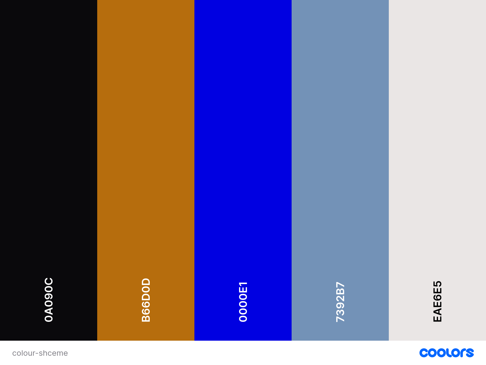
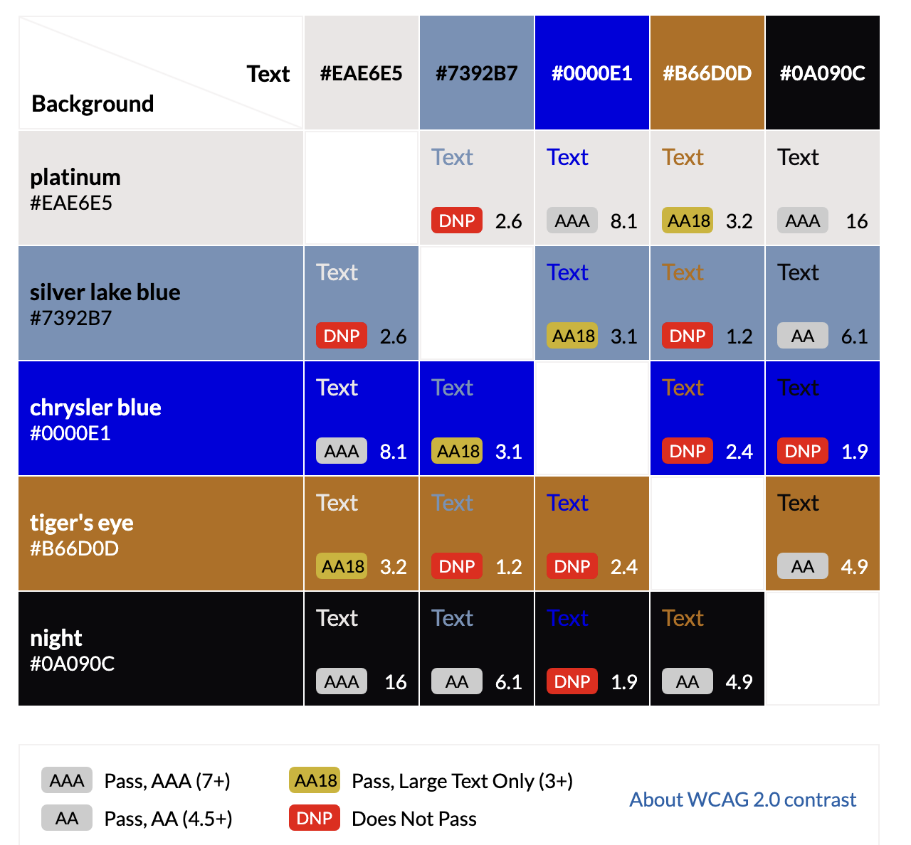

# Ashley Zeal

Ashley Zeal is a landing page that aims to expand Ashley Zeals online presence as an artist. Ashley Zeal's landing page will serve as a hub where users can easily view and engage in Ashley's content. It will showcase Ashley Zeal's discography, a gallery containing photos and videos from previous events, a biography and a contact form. 

The purpose of this landing page is to expand Ashley Zeal's online presence while maintaing a professional theme and maintaining and easy-to-navigate/easy-to-use page for users.

## Contents
* [User Goals](#user-goals)
* [User Stories](#user-stories)
* [Goals & Objectives of website](#-goals-and-objectives-of-the-website)
* [Wireframes](#wireframes)
* [Design](#design)
  + [Typography](#typography)
  + [Colour Scheme](#colour-scheme)
  + [Images/video](#images-video)
  * [Audio](#audio)
  +  [Responsiveness](#responsiveness)
- [Features](#features)
  * [Existing Features](#existing-features)
    + [Header](#header)
    + [Discography](#discography)
    + [Gallery](#gallery)
    + [Biography](#biography)
    + [Footer](#footer)
  * [Future Updates](#future-updates)

## User Goals

* User friendly navigation
* Professional & consistent style/theme
* Written in english
* Responsiveness for different screen sizes

## User Stories

* As a user, I want to be able to view new releases and listen to them.
* As a user, I want to be able to contact/book Ashley Zeal for events.
* As a user, I want to be able to view content from events Ashley Zeal has performed at.
* As a user, I want to be able to learn more about what inspires Ashley's music and his story.
* As a user, I want to be able to use the website on different devices.
* As a user, I want Ashley Zeal's social handles to keep up to date with social media posts.
* As a user, I want clear, intuitive navigation.
* As a user, I want the content to be accessible for people with additional needs.

[Back to Top](#contents)

## Goals and Objectives of the Website

* Provide users with entertainment whilst keeping up to date with Ashley Zeal's current events and music.
* Include or provide access to all of Ashley Zeal's discography.
* Provide accurate content.
* Easy-to-use and easy to navigate to cater for different audiences.
* Invite users to use booking/contact form to book Ashley Zeal for events.
* Intergrate accessibility features for user with additional needs.
* Increase overall website traffic by increasing rankings on search engine.

## Target Audience

* Fans of Ashley Zeal
* Music enthusiasts
* Music Industry professionals
* Casual users 

[Back to Top](#contents)

## Wireframes

The wireframes are designed using Balsamiq tool. I will follow best practices and design mobile first, then tablet and lastly desktop/laptop display. It is a one page website to enhance logical flow.

* [Mobile Wireframe](docs/mobile-wireframe.pdf) 
* [Tablet Wireframe](docs/tablet-wireframe.pdf) 
* [Desktop Wireframe](docs/desktop-wireframe.pdf) 

[Back to Top](#contents)

## Design

### Typography

I have chosen two font-families to use for Ashley Zeal's website. The first font-family I chose [Baumans](https://fonts.google.com/specimen/Baumans). It is a sans-serif font with an geometric, Artistic feel. I picked Baumans as the primary font I will be using for headings and buttons as it is a clean, stylish and easy-to-read font making it ideal to use for web design.  
  
The second font-family I have chosen to use is [Savate](https://fonts.google.com/specimen/Savate). I chose this font to use for text like paragraphs or captions. It is also a sans-serif type font however, it has a more expressive,  cursive style whilst maintaining being easy-to-read making it ideal to use in web design.

### Colour Scheme

The colour scheme was chosen based off images used throughout the site and colours commonly associated with rnb and soul music, (two genre's of music Ashley Zeal is known for).
  
  

I have also used [Contrast Grid](https://contrast-grid.eightshapes.com/ "Contrast Grid") to help decide a visually appealing combination.  

| CSS Name                 | HEX       | Comment                                                                       |
| ------------------------ | --------- | ----------------------------------------------------------------------------- |
|   --platinum             | #EAE6E5 |  Font colour for paragraph or caption like text and card background           |
|   --silver-lake-blue     | #7392B7 |  Button colour                                                                |
|   --chrysler-blue        | #0000E1 |  Highlight colour                                                             |
|   --tigers-eye           | #B66D0D |  Font colour for headings and titles                                          |
|   --night                | #0A090C |  Background colour of the site                                                |

[Back to Top](#contents)

### Images/video

Ashley Zeal has provided images and videos he would like to include on the website. The images has a mix of professional studio shots and performace shots. The video is a performance of Ashley singing at an event.

### Audio

I will embed spotify player into the discography page where users are able to play Ashley Zeals music and also be invited to follow him on spotify and/or copy song links.